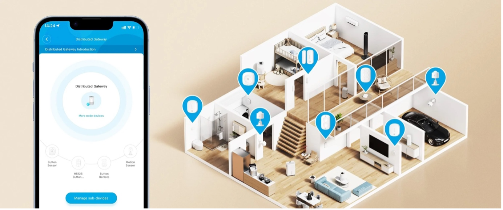
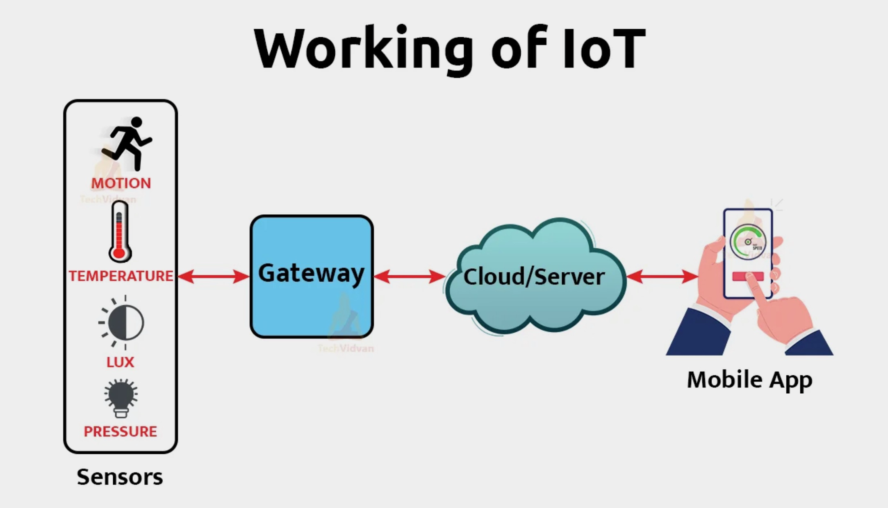
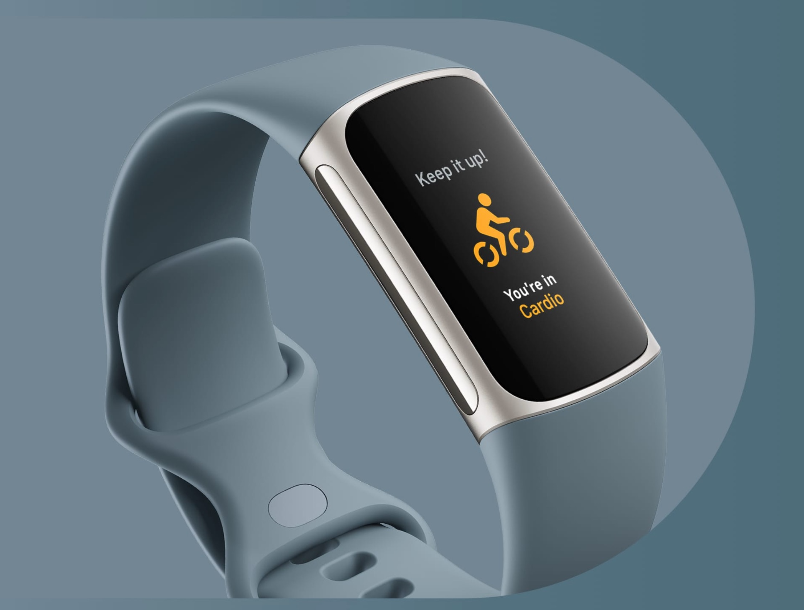
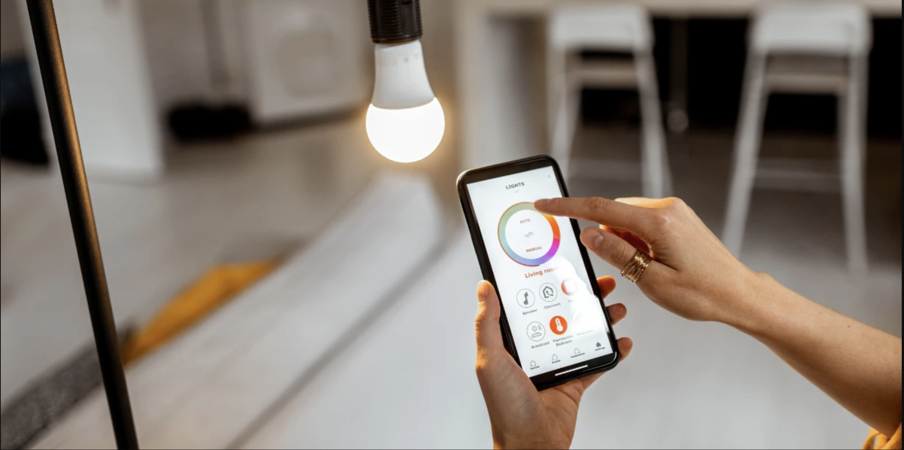
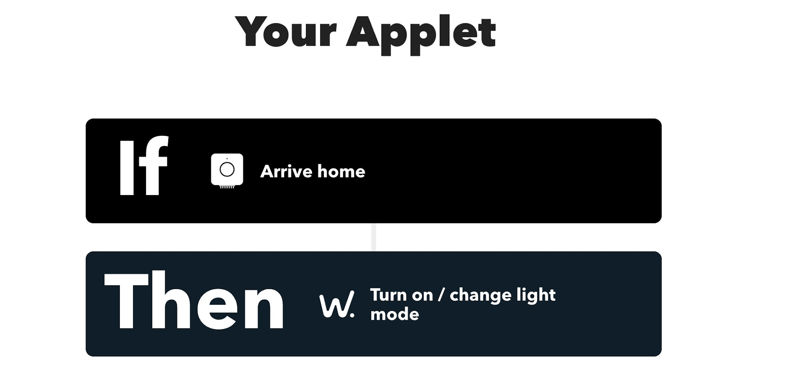

<section data-markdown>
    <textarea data-template>
        ## Intro: Internet of Things
##### Global Code | 2024

---
## Internet of Things
"The Internet is the global system of interconnected computer networks that use the Internet protocol suite (TCP/IP) to link devices worldwide."
> Wikipedia

Note:

I hate wikipedia definitions but I guess you've got to start somewhere. 

Remember that one of our application questions was "What difference does technology make to the lives of your family or the people around you?". Really nice opportunity to rekindle that discussion and learn how people use the internet here, before kicking off the class about hardware and physical compute.

It's likely that by this time you've done the GPIO work, so our students should hopefully start to see how all this ties together!

---
## Internet of Things
"The Internet of Things, or IoT, refers to the network of physical objects ('things') that are embedded with sensors, software, and other technologies. The purpose is to connect and exchange data with other devices and systems over the internet."
> Wikipedia

Note: 
Imagine if everyday objects in your house could send you messages through the internet. For example, if someone breaks into your house, sensors on the doors and windows could instantly alert your smartphone.

---
## Internet of Things
How it works?
* Devices:  These are the 'things' in IoT, like sensors, smartwatches, or refrigerators, equipped with technology to collect data.
* Connectivity: These devices need a way to send the data they collect to the cloud or directly to other devices. This can happen via Wi-Fi, Bluetooth, cellular networks, or other means.
* Data Processing: Once the data reaches its destination, it needs to be processed. This can happen on a computer, a cloud server, or even on the devices themselves.
* User Interface: Finally, the processed data is made useful to the users through interfaces like smartphone apps, web pages, or even voice responses. This is where you can check data, control IoT devices, or receive alerts.

---
## Internet of Things

A simple diagram illustrating how IoT works.

<!-- > [Reference]"(https://techvidvan.com/tutorials/how-iot-works/) -->

---
## Internet of Things

Fitbit - a wearable IoT device

Note:
The FitBit is a "wearable" device which senses and records your heartrate and stepcount. When you get home it uploads this information to the internet where you can access it and share it with your friends. FitBit allows you to set goals and alerts you when you've met them by buzzing on your arm. There's a website and an app for your phone.

---
## Internet of Things

Hue - smart lights with an app

Note:
An intelligent light that's controllable through an app, or through Siri on your iPhone. You can set different moods for different times of the day - for example have the lights dimmed in the evening - or have pre-set choices for when you have a party or event.

---
## IFTTT(If This Then That.)
IFTTT is a service that lets you make simple rules, called applets, which tell your devices what to do when something happens.

Applets are small programs created within IFTTT that automate actions between your internet-connected devices. 

Example: If I arrive home, then turn on the lights.

IFTTT connects your IoT devices in useful ways without needing any complex programming. 

Note:
We'll browse to www.ifttt.com - to see how we can quickly and easily "tie up" internet events. Look here for some example recipes: https://ifttt.com/discover

Here you can also talk about some potential drawbacks for IoT. In my experience the class is more attuned to job losses through automation than they are to security concerns.
https://blog.cloudflare.com/iot-security-anti-patterns/

## IFTTT(If This Then That.)

Example of applet created on the IFTTT website. 

---
## IFTTT(If This Then That.)
Benefits And Challenges of IoT?

Note:
Interaction with class, what are some of the benefits and challenges of IoT?
-Benefits
Convenience, efficiency, energy savings
Discussion on real-life impacts of IoT
-challenges
Privacy concerns
Security risks
Technical issues like connectivity

    </textarea>
 </section>
