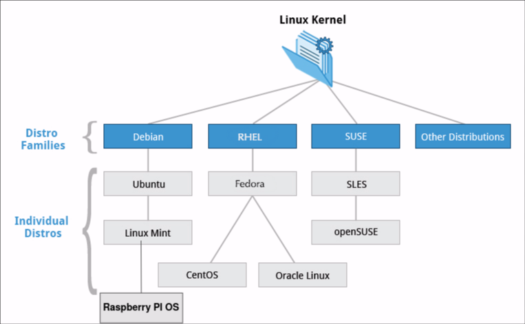

<section data-markdown>
    <textarea data-template>
        ## Intro: Internet of Things
##### Global Code | 2024


---
The computer is one of the most important inventions of the 20th century. Everything seems to run on computers now. But the hardware we think of as the “computer” is nothing without an interface between computer users and the hardware, which is where the operating system comes in.

## What is Linux ?
Linux is an open source operating system (OS). 

---
Note:
A good start to the class would be asking the students if they know what Linux is, although they may be quiet at first, we found that the more engaging a class is, the more keen they are to learn too.

* What is an operating system?
    * most important software on your computer, allow us to communicate with a computer without knowing how to speak the computer's language
* What does an operating system do? 
    * Process scheduling, memory, device and file management, security) 
* What are other famous open source operating systems?
* Do they use an OS?


Every Linux-based OS involves the `Linux Kernel`.

That's the main component of the Linux operating system, communicates between a computer's hardware and its processes.

A nice analogy to explain the role of the kernel:

```
The kernel is a busy personal assistant for a powerful executive (the hardware).

It’s the assistant’s job to relay messages and requests (processes) from employees and the public (users) to the executive, to remember what is stored where (memory), and to determine who has access to the executive at any given time and for how long.
```

---
## Linux and Open source
Anyone can run, study and modify and redistribute the Linux source code.

---
## Linux Distributions

Linux distribution = complete Linux system package

The reason why different distros exist is because Linux is an open and free system. This means that people who have different needs and different philosophies can use and develop Linux - each according to their own needs.

---
## Linux Distributions
For example, some people like to have a large corporation support them, and are prepared to pay for that support. Other people don't want to pay, but want a system that is stable and doesn't change unless they choose to update it. There are also people who are excited by what the technology can do, and want to try out new things - and don't mind if things break occasionally as long as they have the latest and greatest.

None of those viewpoints is right or wrong - they're just different ways to look at the world, and Linux (and Free and Open Source in general) can accommodate all of those different perspectives.

---
## Linux Distributions
The right to use, change, modify and share the code is a fundamental freedom. The only thing that is asked of you in return is that you respect the freedom of others to do as they want to with the code, and any changes that you make to it.

  <!-- Copyright freecodecamp -->

---
## Command Line
The command line is your direct access to a computer.

It's like a text interface to your computer.

The command line and open source software, together, give users unrestricted access to their computer.

Note:
* Do any students use the command line?
* How else do we refer to it? Hint: terminal, shell, console
  
---
## Command Line
Why would we use a text interface?

At first, it might seem that it's old-fashioned and that there must be better ways to work with the computer in 2024.

---
## Command Line

However, although learning the shell does require some effort, it enables a proficient user to reach a level of control and power over the computer that no graphical tool can match.

---

## Command Line
Not only are there a great many useful tools immediately available in the terminal, it also provides a way to combine the existing tools into `pipelines` that can accomplish almost anything a power user could want to do.

Learning to build pipelines also teaches fundamental concepts of computer science, as the tools that we combine are by themselves each quite small - the power comes from the combination. 

---
## Command Line
One of the core ideas of the Linux / Unix philosophy is: `"When making tools for others, have the program do one thing, but do it well"`. For the user, they can then choose which of the small tools they want to combine, to build up the tool they actually need.

    </textarea>
 </section>
